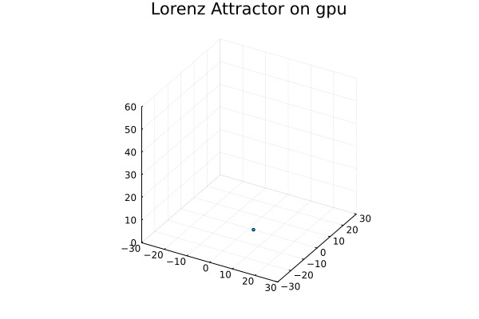

# CUDA enabled Lorenz System using Julia
This project aims to explore the use of Julia and CUDA through a practical case study.

## Project Description

I leveraged JuliaGPU (https://juliagpu.org/) to execute Julia programs on NVIDIA CUDA-enabled GPUs. This project tackles the Lorenz system using CUDA on GPUs within the Julia programming environment.

*What is Lorenz system?*
The Lorenz system is used to model certain types of chaotic dynamical systems. In my case study, I utilize a set of three equations, shown below, to simulate the movement of a particle $(x, y, z)$ at each time step. These equations incorporate constants: $dt=0.01, σ=10, ρ=28, β=8/3$. The particle's movement at each step is based on its position in the previous step.
$$x_{step} = x_{step-1} + σ * (y_{step-1} -x_{step-1}) * dt$$
$$y_{step} = y_{step-1} + x_{step-1} * (ρ-z_{step-1}) - y_{step-1}$$
$$z_{step} = z_{step-1} + x_{step-1}*y_{step-1} - β*z$$

My GPU implementation leverages CUDA.jl (v3.0) (https://juliagpu.org/) to execute the Lorenz system on the GPU. The CUDA kernel computes the positions (x, y, z) for the next step concurrently at each iteration, utilizing the provided three equations.


The following presents the results for both CPU and GPU implementations. On the left, you'll see plots of the CPU results. On the right, there's a GIF animation visualizing the GPU results. Notably, both results appear to be consistent.
<table>
<tr><td></td>
<td></td></tr>
</table>

Note, another interesting project is [Solving PDEs in parallel on GPUs with Julia](https://pde-on-gpu.vaw.ethz.ch/)
link: https://pde-on-gpu.vaw.ethz.ch

## Benchmark results
This project utilizes CUDA version of the Lorenz system. The hardware platform is an NVIDIA GeForce GTX 1650 GPU with 4 GB memory. Each benchmark executes the GPU kernels 1000 times. The average time and memory usage are then reported below.


|  STEP    | Average time| Memory Usage|
| ---------| -------- | ---------- | 
| 100,000  |  25.7s | 192.75 MiB |
| 200,000  |  57.5s | 390.57 MiB | 
| 300,000  |  93.2s | 572.63 MiB |
| 400,000  | 106.1s | 768.32 MiB |
| 500,000  | 157.0s | 950.22 MiB | 
| 600,000  | 166.7s | 1.13 GiB   |
| 700,000  | 204.9s | 1.31 GiB   |
| 800,000  | 244.9s | 1.50 GiB   |
| 900,000  | 260.8s | 1.68 GiB   |
| 1000,000 | 305.4s | 1.88 GiB   |


<table>
<tr><td></td>
<td></td></tr>
</table>
The benchmark results indicate that memory usage increases linearly with the number of steps. Average execution time also increases with steps, exhibiting some fluctuation around 500,000 steps. This indicates the CUDA


## Code Organization

```src/``` This fold stores the source code (`lorenz_cud.jl`) of CUDA and CPU version of Lorenz system. 

```images/```
This folder contains the output images generated by both the CUDA and CPU versions of the Lorenz system.
- `lorenz_cpu.png`: PNG image output from the CPU-based Lorenz system.
- `lorenz_gpu.png`: PNG image output from the CUDA-enabled Lorenz system.
- `lorenz_gpu.gif`: GIF animation output from the CUDA-enabled Lorenz system.
- `average_time.png`: PNG image visualizing the average execution time benchmark results for the CUDA-enabled Lorenz system.
- `memory.png`: PNG image visualizing the memory usage benchmark results for the CUDA-enabled Lorenz system.


```README.md``` the description of the project

```Makefile ``` Makefile of project code 